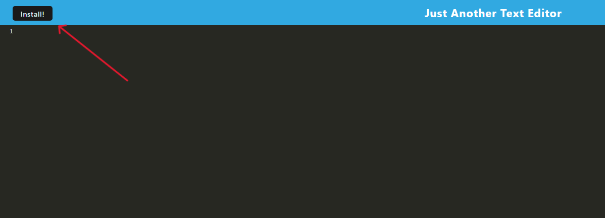

# Just Another Text Editor

  
## Description

This application lets you write code online or offline and stores it in an indexdb so that it will be available offline as well. This application is also a functioning progressive web application, so you can download it and it will function similar to a full computer application that you can access offline.

This is my first project working with service workers and progressive web applications, so there was a lot I had to learn in order to get this application to function and deploy properly.

## Installation

You can visit the deployed website for the application [on render](https://one9-probable-octo-goggles.onrender.com/). You can click the "install" button to download the application on your local machine and access it offline.

You can also clone the repository for yourself and run the commands `npm run install` and `npm run start`. You can then view the application on `http://localhost:3000/`.

## Usage

There are multiple other commands that this app makes use of. `npm run start:dev` will run concurrently, which will run the server and the client simultaneously, `npm run server` will start the server, but ignore the client, and `npm run client` will start the client and start it, but not the server.

This application functions just like a text editor for code, and will even change colors based on the commands you pass into it, so it is especially useful for software developers because you can use it as a place to store valuable coding notes or functions.

## Contributing

This project was coded from the starter code repository [cautious-meme](https://github.com/coding-boot-camp/cautious-meme) by github user [Xandromus](https://github.com/Xandromus).

There was a lot of research that went into how to start service workers and make a functioning PWA. Like finding out that I had to set an expiration priority so that the render site stayed live. I borrowed a lot of code that was used as examples in the exercizes from module 19. This code helped instrumentally in understanding what features I should be implementing with the application.

## License

This project was coded using the MIT license. Refer to the [license document](./LICENSE) for more information.

## Questions

Questions about the project should be directed through the following contacts below.
Link to github profile: [mcellis1](https://github.com/mcellis1)
Email: [matthewcellis98@gmail.com](mailto:matthewcellis98@gmail.com)
